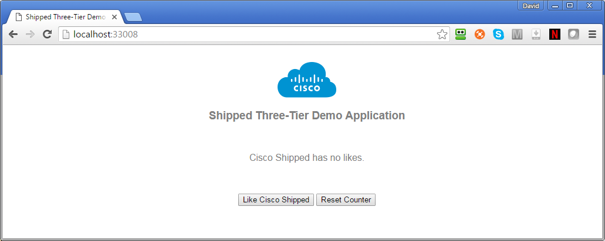

# vote-ui - Shipped Three-Tier Demo Application UI

This repository is part of a demonstration three-tier Shipped application (UI, API, and database).  It should be deployed together with its companion repository, [CiscoCloud/vote-api](https://github.com/CiscoCloud/vote-api) and the standard Shipped Postgres datapack.  

### Running the Three-Tier Demo on Your Laptop
1. Fork the two repositories, [CiscoCloud/vote-api](https://github.com/CiscoCloud/vote-api) and [CiscoCloud/vote-ui](https://github.com/CiscoCloud/vote-ui), into your own GitHub account (or into the account of an organization for which you have admin access).
2. In a browser (we recommend Chrome), navigate to the [Cisco Shipped UI](http://ciscoshipped.io/).  If necessary, press `Sign up with GitHub` to login.
3. If Shipped does not display a **Create Your Application** popup dialog, select "Create New Application" from the **Your Projects** dropdown in the upper right of the form.
4. Enter a suitable name for your application (for example, "demo-three-tier") and press `Start Composing`.
5. Shipped displays the **Compose Your Application** form open to the Develop tab.  Click on `Add an existing repository`, enter "vote-ui" in the `New repository name` field and press Enter.  Shipped adds the vote-ui service to yoru application.
6. If necessary, click on `Add an existing repository` again.  Then enter "vote-api" in the `New repository name` field and press Enter.  Shipped adds the vote-api service to yoru application.
7. Click on Datastores.  Look for the **Postgres** datastore and click on its Select button.  Shipped adds the Postgres datastore service to your application.
8. Click `Save Project`.  Shipped builds the project.
9. In order to bootstrap the project to your laptop, it's necessary for you to install the Shipped CLI.  The method for doing do depends on your OS:
   * Linux or Mac. Run command `curl https://api.ciscoshipped.io/cli/static/shipped-setup.sh | bash -s`
   * Windows.  Download and run [shipped-install.exe](https://bintray.com/shippedrepos/shipped-install/download_file?file_path=windows%2Fshipped-install.exe)
10. You will need an user token to identify yourself to the Shipped CLI.  To get one, click your name in the upper right corner of the Shipped UI, select `My Profile`, and then click on the large `Show My User Token` button.  Shipped reveals the token.
11. Change to the directory where you want Shipped to create local copies of your repos and issue the command: 

    shipped local boot *applicationName* -t *userToken*

    where *applicationName* is the name you gave your application in step 4, and *userToken* is the token copied and pasted from the Shipped UI in step 10.
12. The local boot command produces considerable output as it builds local repositories for your project's services and deploys them into a local VM, creating one if necessary.  It finishes with output similar to:

        ============================================================
        3 services are running and are available at the web addresses below
        ------------  ------------  --------------             ------                 -------------------
        Service Name  Container ID  Container Name             Status                 Service Web Address
        ------------  ------------  --------------             ------                 -------------------
        vote-api      9e5575c84c1f  demothreetier_vote_api_1   Up Less than a second  http://localhost:38893
        vote-ui       d2a55bcd02ae  demothreetier_vote_ui_1    Up 9 seconds           http://localhost:33008
        postgres      eb37d4b7488a  demothreetier_postgres_1   Up 20 seconds          n/a - not exposed
        ============================================================
13. Copy and paste the web address for the vote-ui service (http://localhost:33008 in this case) to the address bar in a browser and press Enter.  You should see the demo application as shown at the top of this page.  Press the `Like Cisco Shipped` button and watch the like count go up.  Open the application in a different browser to verify that the like count is being updated in the database in the application's PostGres service.
